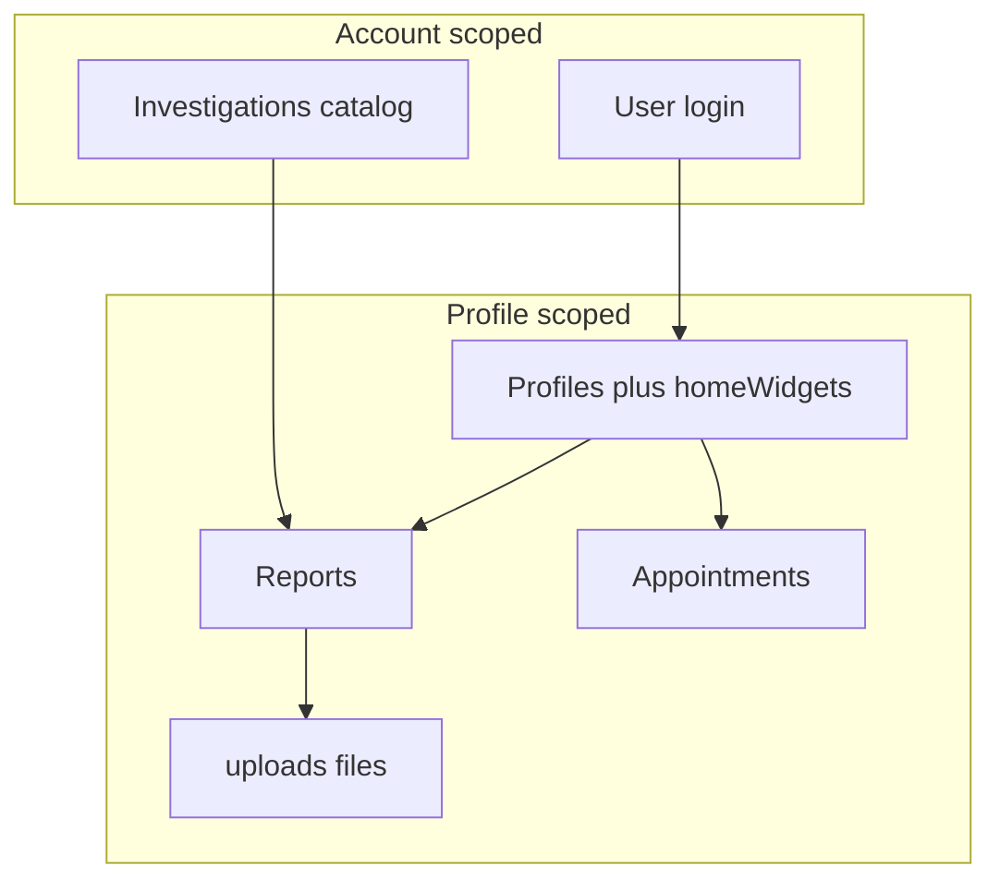
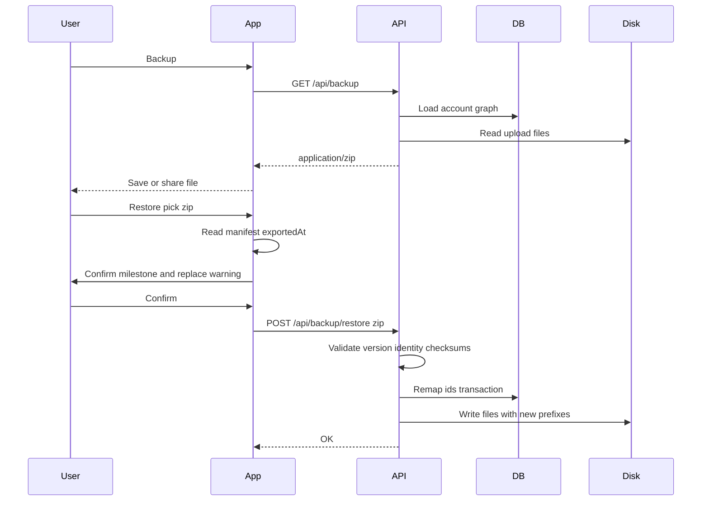

# Backup and restore analysis

Nothing in either repo exports or imports an account. Health data lives only in MongoDB plus local `uploads/` files. The Expo app caches nothing durable (SecureStore holds login preference and theme only). A user backup must therefore be **server-assembled and downloaded**, not dumped from the phone.

The closest existing inventory of “everything for an account” is [`DELETE /api/user`](health-tracker-server/controllers/userController.js): it finds all profiles for `parent = accountId`, then deletes reports (and unlinks files), appointments, investigations, sessions, profiles, and the user.

---

## What “entire data” is

**Include in a restorable backup**

- **Profiles** — `user` (profile id), `parent`, `name`, `age`, `gender`, `homeWidgets` ([`models/Profile.js`](health-tracker-server/models/Profile.js)). One account can have many profiles; extra profiles cannot log in.
- **Investigations** — `_id`, `label`, `unit` for the account ([`models/Investigation.js`](health-tracker-server/models/Investigation.js)). Catalog is per-account copies of the seed in [`constants/investigations.js`](health-tracker-server/constants/investigations.js), plus any custom types. Seed constants are not a substitute for backing up the user’s rows.
- **Appointments** — per profile: `location`, `timestamp`, `remarks`.
- **Reports** — per profile: `investigation` (hex `_id`), `value`, `timestamp`, optional `appointment`, `remarks`, `filename`.
- **Files** — binaries under `uploads/` named `{profileId}_{timestamp}_{objectId}.{subtype}`, max 3MB, PDF or image ([`middleware/upload.js`](health-tracker-server/middleware/upload.js)). DB only stores the basename.

**Exclude from a user-facing backup**

- **Sessions** — ephemeral JWTs; restoring them would hijack devices.
- **Password hash, `emailToken`** — credentials must not leave the server in a file the user can copy or lose.
- **`isAdmin`** — privilege flag; restore must not let a file grant admin.
- Client-only prefs (theme, “Trust this device?”) — not health data.

Optionally include a **non-secret account stub**: display `name`, and `username` (email) as metadata so the file is identifiable. Do not treat that as a restore of login.

**Existing APIs are not enough to assemble this from the client.** Reports and appointments are scoped to the **active** JWT profile; files download one-at-a-time via `GET /api/reports/download`. A complete backup would require switching every profile, paging lists (`count` truncates), and N+1 file downloads. Packaging must happen on the server.

---

## What would be needed (if you build it)

### 1. Product rules (decide before coding)

These change the API more than the file format does:

- **Backup is a copy, not a delete.** `GET /api/backup` only **reads**. It must not `deleteMany`, `findOneAndUpdate`, unset fields, unlink `uploads/`, or otherwise mutate the account. After a successful or failed backup, Mongo documents and files on disk are unchanged. Restore (replace) is the destructive operation; backup is not.
- **Scope** — whole account (all profiles) vs active profile only. “Entire data” means **account**.
- **Restore target** — always the **logged-in** account (`req.user`). Never trust `accountId` or username inside the zip as the destination.
- **Account mismatch** — UserY uploading UserX’s zip is detected and **not applied silently**. See [Account mismatch](#account-mismatch-userx-zip-on-usery).
- **Conflict policy** — **replace** (wipe then load) vs **merge** (skip/overwrite duplicates). Replace is simpler and matches “restore a backup”; merge needs duplicate keys (label, timestamp+investigation, etc.).
- **Who can call it** — Settings already gates delete-account on `auth.isAdmin`. Backup/restore should likely be available to **every** logged-in primary profile (`req.user === req.profile`), not only admin, and forbidden while switched to a family profile (same pattern as delete).
- **Backup timestamp** — every archive has one server-UTC `exportedAt`. It appears in the download filename, in an inner folder name, and in `manifest.json`. Restore confirmation reads the **manifest**, not the filename (people rename files). See [Timestamp and restore confirmation](#timestamp-and-restore-confirmation).

### 2. Server: snapshot + restore pipeline

Backup enumeration uses the **same read query** as account delete (who belongs to this account), but **only `find` / `lean` / file `read`**. Do not call `unlinkReportFiles` or any delete.

- `profiles = Profile.find({ parent: accountId })`
- `investigations = Investigation.find({ user: accountId })`
- `reports` / `appointments` for all `profile.user` ids
- read each `Report.filename` from [`UPLOADS_DIR`](health-tracker-server/helpers/uploads.js) (copy bytes into the zip; leave the originals)

Restore order (strict):

1. Ensure account exists (logged-in user; do not create a User from the file).
2. Profiles (remap `user` / `parent`; primary profile stays `user === parent === current accountId`).
3. Investigations (new `_id`s unless you preserve ids on an empty DB).
4. Appointments (new `_id`s).
5. Reports (rewrite `investigation`, `appointment`, `user`).
6. Files (rename to `{newProfileId}_…` so [`downloadReport`](health-tracker-server/controllers/reportsController.js) prefix auth still works).
7. `homeWidgets` after investigations exist.

**ID remapping is the hard part.** Investigation FKs are hex `_id`s on reports and `homeWidgets`. Appointment `_id`s sit on reports. Upload names embed the old profile id. A restore into a live account **must** allocate new ObjectIds and rewrite every FK; preserving old ids will collide with existing rows or leak another user’s prefix.

Wrap restore in a Mongo **transaction** (replica set) or a two-phase “stage then swap” so a failed import does not leave a half-written account. Abort if the archive schema version is unknown, checksums fail, or a file is missing / over 3MB / not PDF|image.

### 3. APIs (new; none exist)

Suggested contract, account-scoped, JWT required, primary profile only:

- `GET /api/backup` — **read-only** snapshot: build archive, `Content-Disposition: attachment; filename="health-tracker-backup-YYYYMMDDTHHMMSSZ.zip"`, stream to client. No DB writes, no file deletes. `exportedAt` is **server clock UTC**, not the device clock.
- `POST /api/backup/restore` — multipart file upload of that archive; body flag `mode=replace|merge`.
- Optional `GET /api/backup/export.csv` or `export.pdf` for **non-restorable** human copies.

Do not stream a raw `mongodump` or return password hashes. Put a `schemaVersion` and `exportedAt` in the manifest so later app versions can migrate old files.

Size: each attachment is up to 3MB. For a family account with many PDFs this can be tens of MB. Stream the zip; do not hold the whole buffer in RAM. Cap archive size and return 413 if exceeded.

### 4. Device (Expo iOS / Android / web)

Today there is **no** `expo-file-system` / `expo-sharing` usage. Preview downloads stay in memory ([`ReportsApiManager`](health-tracker-app/api-managers/ReportsApiManager.js)). You would add:

- **Backup:** `GET` as `arraybuffer` → write to cache using the `Content-Disposition` filename (timestamped) → **Share** / **Save to Files** (native) or `<a download>` blob (web).
- **Restore:** pick zip → **read `manifest.json` on device** (`exportedAt`, counts) → confirmation dialog (milestone + replace warning) → on confirm, `multipart` POST. Do not skip confirm. Do not use the filename as the date shown.
- **UI:** Settings ([`app/(tabs)/more/settings.jsx`](health-tracker-app/app/(tabs)/more/settings.jsx)) under Account, next to delete.
- Refresh TanStack Query (or log out/in) after restore.

iOS needs a share-sheet save; Android can target Downloads; web uses the browser download bar. There is no offline DB to backup.

### 5. Safety (health data)

- Only the authenticated account’s rows; never accept `accountId` from the file as the restore target.
- Strip secrets on export; ignore secrets on import.
- Optional password-protected zip (AES) if files will sit in iCloud/Google Drive.
- Confirmations, and prefer **replace only when the user types a phrase**, same spirit as delete account.
- Do not restore sessions or `isAdmin`.

### Account mismatch (UserX zip on UserY)

The zip is **not** bound to a Mongo `_id` as the restore destination. It **is** labeled with who it was exported for.

**Export:** `manifest.json` includes `source.username` (the account email at backup time). No password, no session, no `isAdmin`. Do not put `User._id` in a field the client could send back as “restore into this account.”

**Restore:** after unzip/validate, compare `manifest.source.username` to the logged-in `User.username` (trim; case-insensitive if you treat username as email). Then:

1. **Match (UserX zip while logged in as UserX)** — proceed. Still remap document ids onto this account so FKs and `{profileId}_…` filenames stay consistent. Login/password unchanged.
2. **Mismatch (UserX zip while logged in as UserY)** — **do not write**. Return **409** with a dedicated code (e.g. `BACKUP_ACCOUNT_MISMATCH`) and a generic message only, e.g. “This bundle does not match the signed-in user.” **Do not** put `source.username`, display name, or any other owner identity in the response body, logs shown to the client, or Settings copy. UserY’s existing data stays untouched.
3. **Missing/unknown `source.username`** — treat as mismatch (reject) with the **same** generic message. Do not guess. Do not reveal that the manifest was missing a username vs the username differed.

**Why not apply it anyway:** replace would wipe UserY’s health data and attach UserX’s PHI to UserY’s login. That is usually a wrong-file accident. Possession of the zip already means UserY can open the files; the API must not become a silent “load anyone’s backup into my account” tool.

**Why username, not `User._id`:** same person on a new database (reinstall, new server) gets a new `_id` but the same email. Username match still allows restore. Binding to the old ObjectId would false-reject a legitimate UserX → UserX restore.

**What this does *not* stop:** an unencrypted zip sitting in Files/Drive can be opened outside the app. Mismatch handling protects the **wrong account on the server**, not the file at rest. Password-protecting the zip is a separate control.

**Locked: hard reject on mismatch. No override in v1.** UserY must log in as UserX to restore that zip. Do not add a “restore anyway” control unless product later wants a new-email migration path.

A later override, if ever added, would still remap ids onto `req.user` and never treat the id in the file as the destination.

### Timestamp and restore confirmation

Backup is a **milestone copy**. Stamp it once from the **server UTC clock** (`exportedAt`). Use that same instant in three places so a unzipped folder, a Downloads list, and the restore dialog agree:

1. **Download filename** (for picking the right file in Files/Downloads): `health-tracker-backup-20260913T143022Z.zip`. Compact UTC, sortable, **no email/username** in the name (sharing the file should not advertise the account). Seconds avoid collisions if someone backups twice in one minute.
2. **Inner folder** (for when they unzip): `health-tracker-backup-20260913T143022Z/manifest.json`, collections, and `files/`.
3. **`manifest.json`** (source of truth): `{ schemaVersion, exportedAt: "2026-09-13T14:30:22.123Z", … }`. Optional: `counts` (`profiles`, `investigations`, `appointments`, `reports`, `files`) for a richer confirm screen.

**Do not trust the filename on restore.** Users, email clients, and iOS Files rename downloads. The confirm UI must parse `manifest.exportedAt` from inside the zip on the device (e.g. JSZip) before `POST /api/backup/restore`. If `exportedAt` is missing or unparsable, refuse locally with a generic invalid-bundle message — do not POST.

**Confirm copy (before any write):**

- Date/time in the **device locale and timezone**, with an abbreviation (e.g. “13 Sep 2026, 8:00 PM IST”), derived from `exportedAt`.
- Explicit replace warning: restoring **replaces the current account data** with this snapshot. Anything on the server that is not in this backup (including data saved after this milestone) will be gone. Login/password stay.
- Optional but useful: “3 profiles, 42 reports, 12 files” from `counts` so two backups from the same day are distinguishable.
- Do **not** show `source.username` on this dialog (keeps owner identity off the screen if the wrong zip was picked; mismatch still 409s with the generic bundle message).

**Better than filename-only:** a preview/inspect API would upload the whole zip twice. Reading the manifest locally is enough for confirm; the server still re-reads `exportedAt` and identity on POST and ignores client-supplied dates.

**Not recommended:** device clock on export (two phones would disagree); putting the user’s email in the filename; using OS file `mtime` as the milestone.

---

## What you do to restore (user path)

This feature does not exist yet. If it is built as recommended (ZIP restore into the **logged-in** account, **replace**), the user path is:

1. **Have an account and log in.** The backup file does not contain your password. Restore never creates a login from the zip. New phone, reinstall, or new server: register or log in first, then restore.
2. **Use the primary profile** (the account owner, not a switched family member). Restore is account-wide; same gate as delete account (`req.user === req.profile`).
3. **Keep the backup file on the device** (Files / iCloud / Downloads / a share). It must be the restorable ZIP from Backup, not a CSV or PDF export.
4. **More → Settings → Restore → pick the zip.** The app reads the milestone from inside the zip and asks to confirm: when this backup was created, and that restore will set the account to that snapshot (current DB state is replaced; later data is lost). Then upload.
5. **Wait for the server to finish**, then the app refreshes (or you stay logged in with the same email/password). Family profiles, lab types, readings, and PDFs/images come back; theme and “Trust this device?” do not come from the zip.

You do **not** unzip the file, paste JSON into Mongo, or copy `uploads/` yourself. The app uploads the zip; the API validates it, remaps ids onto *this* account, and writes files with new profile-id prefixes.

**What stays yours vs what is replaced**

- **Kept:** login (email/password), email-verification state, admin flag, current session.
- **Replaced (typical):** all profiles except the login identity of the primary profile, all investigations, appointments, reports, and attached files.
- **Not in the file:** sessions, password hash.

**Other situations**

- **Same phone, undoing a mistake:** log in as the same user → Restore → pick an older zip → confirm. Current data on the server is overwritten.
- **UserY picks UserX’s zip:** restore **aborts**. UserY keeps their data. Settings only says the bundle does not match the signed-in user — it does not name UserX. They must log in as the owner to restore that zip.
- **New email / new account (UserX data → UserY login):** not allowed in v1. That is the mismatch case. Only add a confirmed override if you want that migration path.
- **Merge instead of replace** (not the default): you would still pick a file, but existing rows would be kept and backup rows added, with duplicate-handling rules. Harder; not the first version.
- **CSV/PDF only:** those are exports you can open in Excel or share with a doctor. They cannot restore the account.

---

## Formats: DB → API → device

Two layers: **how the API sends bytes**, and **what schema is inside**. Restore needs a structured, versioned container plus original file bytes. Human-readable formats are extra, not a replacement.

### A. Restorable containers (recommended to support one)

**1. ZIP + JSON manifest + original files (best default)**

- API: `Content-Type: application/zip` download; restore as `multipart/form-data`.
- Inside: folder `health-tracker-backup-<UTC stamp>/` containing `manifest.json` (`schemaVersion`, `exportedAt`, `source.username` for server-side match only, optional `counts`) + `profiles.json` / `investigations.json` / `appointments.json` / `reports.json` + `files/<filename>`.
- Pros: originals stay PDFs/images; unzippable on the phone; maps 1:1 to collections; streaming; no base64 bloat (~33%).
- Cons: need an archive library on the server (`archiver` or similar; not in [`package.json`](health-tracker-server/package.json) today); client treats it as opaque until restore.
- **This is the format that actually matches “entire data including attachments.”**

**2. Single JSON document (`application/json`)**

- Nested object: `{ schemaVersion, profiles, investigations, appointments, reports }`.
- Files as **base64** fields or omitted (metadata-only).
- Pros: easy to inspect, diff, and parse; simple `res.json`.
- Cons: huge payloads; RAM; not a natural “file on device” without a download wrapper; base64 is a poor fit for PDFs.
- Use as the **logical schema inside the zip**, not as the only download.

**3. NDJSON / JSON Lines stream**

- One Mongo document per line, typed by a `collection` field.
- Pros: streaming, append-friendly, good for very large accounts.
- Cons: awkward for binaries; worse UX on device than a zip; harder for users to inspect.
- Better as an internal/admin dump than a Settings feature.

**4. Encrypted zip (same layout as #1, password-wrapped)**

- Same restore path after decrypt.
- Pros: safer for Drive/email.
- Cons: password UX, lost-password = lost backup; extra libraries.
- Add later if backups will leave the device.

### B. Human / spreadsheet formats (export-yes, restore-painful)

**5. Multi-CSV zip** (`investigations.csv`, `reports.csv`, …)

- API: still a zip download.
- Pros: Excel/Numbers; users can chart lab values.
- Cons: nested FKs and widgets become opaque id columns; files still need a `files/` folder; round-trip restore is brittle (quoting, dates, missing columns).
- Good as a **second export button** (“Export spreadsheets”), not as the restore format.

**6. Excel `.xlsx` workbook**

- Same tradeoff as CSV with multiple sheets; heavier server dependency. Skip unless you already want office files.

**7. PDF “health summary”**

- Tables of latest values / history.
- **Not restorable.** Fine as a share-with-doctor artifact, separate from backup.

### C. Interop and ops formats (usually out of scope)

**8. FHIR Bundle (JSON)** — Observation, Patient, DocumentReference. Right for leaving this app for a hospital/PHR; expensive (mappings, codes, attachments as Binary). Not needed for “my data on my phone.”

**9. SQLite / Realm file** — portable DB the app could theoretically open offline. You have no local SQLite today; this would invent a second datastore. Not worth it for backup-only.

**10. BSON / `mongodump`** — includes `_id`s and could include password hashes. Ops-only, not a user API, not something to save to Camera Roll/Files.

**11. Client stitching existing REST** — theoretically JSON from current CRUD + N file downloads. Incomplete (profile switch, `count`, no atomic snapshot), slow, and easy to get a torn backup. Do not use this as the product mechanism.

### How the file lands on the device

| Channel | Backup | Restore |
|---|---|---|
| iOS | Share sheet → Files / iCloud | Document picker |
| Android | Share / Downloads | Document picker |
| Web | Browser download | `<input type=file>` / picker |

The API format is the same on all three; only the save/open helper differs.

---

## Recommended shape (when you implement)

- **Restorable format:** ZIP containing versioned JSON collections + raw `files/`.
- **Optional extras:** CSV zip and/or PDF summary (export only).
- **Restore:** logged-in primary profile, remap all ids, rewrite upload prefixes, exclude secrets; start with **replace** on the current account (with delete-level confirmation).
- **Do not** round-trip User passwords, sessions, or `isAdmin`.

---

## Out of scope unless you say otherwise

- Cloud backup to S3/Drive as a product (this analysis is API → device).
- Merging two family accounts.
- Partial restore (one profile / date range) — can be a later filter on the same zip.
- Server-side scheduled backups (ops), as opposed to user-initiated download.
