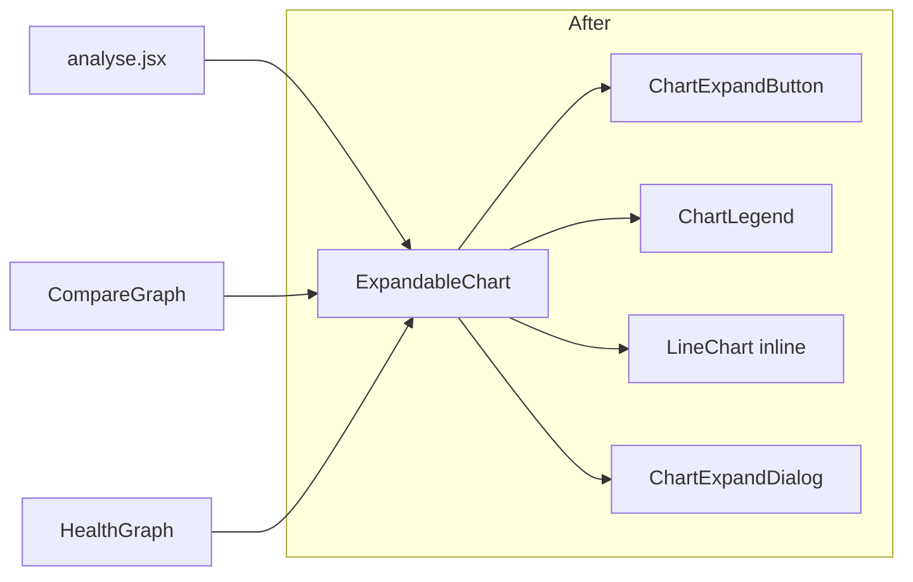

## Problem

The expand-button + inline chart + expand-dialog trio is hand-wired in three places, each duplicating an `expandOpen` state, the `ChartExpandButton` wiring, and the full `ChartExpandDialog` prop list:

- [app/(tabs)/analyse.jsx](app/(tabs)/analyse.jsx) lines 135-151 (single series; dialog title = investigation label; no header title)
- [components/CompareGraph.jsx](components/CompareGraph.jsx) lines 45-73 (multi series; card chrome; inline legend; header title + button)
- [components/widgets/HealthGraph.jsx](components/widgets/HealthGraph.jsx) lines 78-106 (single series; button in `WidgetView` header; dialog fed a *different* dataset `expandedReports` + its own `isExpandLoading`)

The colored-dot legend is also duplicated: [CompareGraph.jsx](components/CompareGraph.jsx) lines 29-45 and `OverlayLegend` in [components/charts/ChartExpandDialog.jsx](components/charts/ChartExpandDialog.jsx) lines 15-47, both hardcoding `[theme.chart.line, theme.chart.lineSecondary]`.

## Approach

Create one `ExpandableChart` that owns the expand state, renders a standardized header row (optional title left, optional `headerRight` slot, expand button right), an optional legend, the inline `LineChart`, and the wired `ChartExpandDialog`. Series config is passed once and shared by the inline chart and the dialog. Dialog data can be overridden (for HealthGraph's separate query).

## New component API

`components/charts/ExpandableChart.jsx`:

- `data` (inline chart data)
- `title` (optional header title, left) and `headerRight` (optional extra actions, e.g. Remove) rendered before the expand button
- Series passthrough: `yAxisKey`, `yAxisKeys`, `unit`, `units`, `seriesLabels = []`, `showNodeValues = true`
- Dialog overrides: `expandTitle` (default `title`), `expandData` (default `data`), `expandLoading = false`
- `showLegend` (default `seriesLabels.length > 1`)

Behavior: renders header row only when `title`/`headerRight`/expand button exist; expand button shown when `data.length > 0`; owns `const [expandOpen, setExpandOpen] = useState(false)`; passes shared series props to both the inline `LineChart` and `ChartExpandDialog`.

## Files to change

- NEW [components/charts/ExpandableChart.jsx](components/charts/ExpandableChart.jsx) - the component above.
- NEW [components/charts/ChartLegend.jsx](components/charts/ChartLegend.jsx) - colored-dot + label legend using `[theme.chart.line, theme.chart.lineSecondary]`; used inline by `ExpandableChart`.
- [components/CompareGraph.jsx](components/CompareGraph.jsx) - replace the local `expandOpen`, inline legend, `ChartExpandButton`, `LineChart`, and `ChartExpandDialog` with `<ExpandableChart title={title} yAxisKeys={investigations} seriesLabels={labels} units={units} data={data} />` inside the existing card wrapper.
- [components/widgets/HealthGraph.jsx](components/widgets/HealthGraph.jsx) - keep `WidgetView` (title, footer, Remove stays in `headerRight`); render `<ExpandableChart data={reports} unit={unit} expandTitle={title} expandData={expandedReports} expandLoading={expandOpen && isExpandLoading} />` in the body when `reports.length > 0`; drop the local `expandOpen`, button, inline `LineChart`, and dialog. (Expand button moves into the chart body - the accepted UX change.)
- [app/(tabs)/analyse.jsx](app/(tabs)/analyse.jsx) - replace the `justify-end` button row + `LineChart` + `ChartExpandDialog` (and the `expandOpen` state at line 33) with `<ExpandableChart data={chartData} unit={investigationUnit} expandTitle={investigationLabel} />`; keep the parent's `reports.length > 0` gating and empty-state text.

## Optional (same trio, low risk)

- Refactor `OverlayLegend` in [components/charts/ChartExpandDialog.jsx](components/charts/ChartExpandDialog.jsx) to reuse `ChartLegend` for the dot+label rendering (keep its landscape sizing wrapper).
- Add a `SERIES_COLORS`/`getSeriesColors(theme)` helper in [components/charts/chartUtils.js](components/charts/chartUtils.js) and use it in `LineChart`, `ChartLegend`, and `ExpandableChart` to kill the repeated color array.

## Verification

- Run the existing chart tests in [components/charts/__tests__](components/charts/__tests__).
- Manually check: analyse trend chart + expand; compare two investigations (legend + expand); home `HealthGraph` widget (inline limited data, expanded full-history data still loads via the separate query).