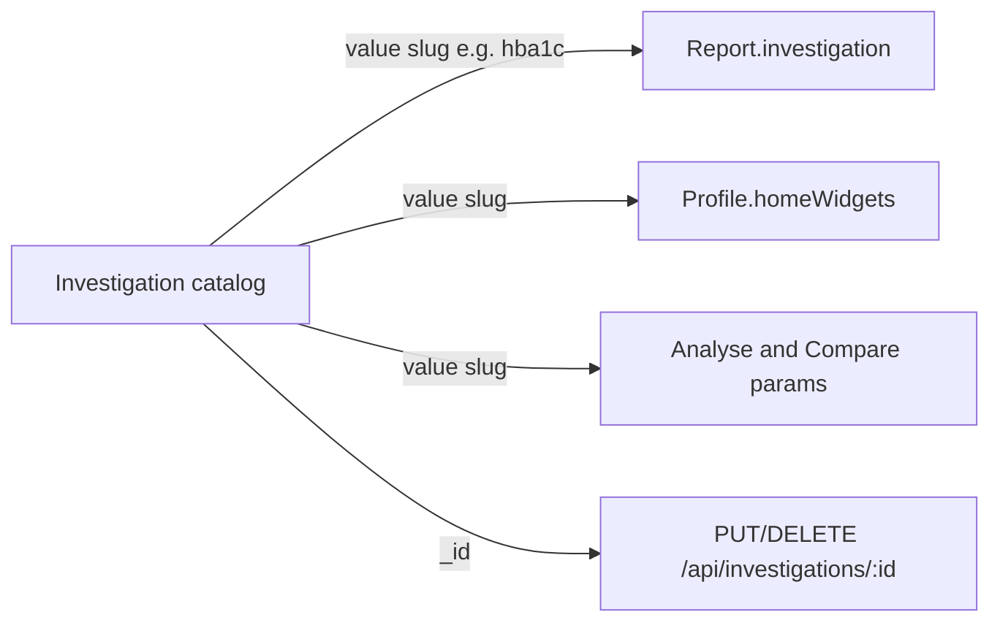
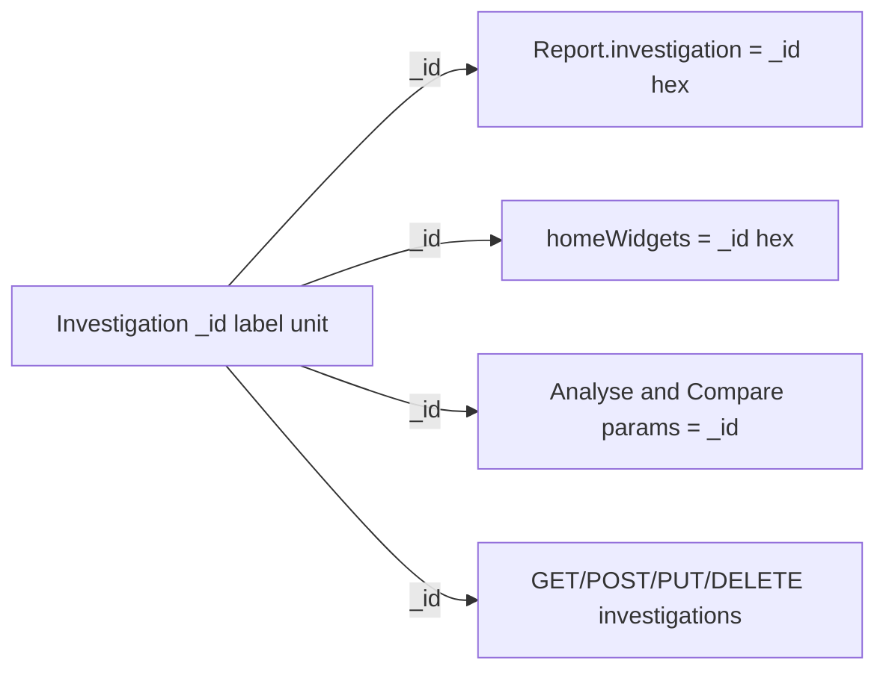

# Replace investigation slugs with Mongo `_id`

## Current model

There is **no separate `slug` field**. The slug is `Investigation.value`. Mongo `_id` already exists and is already used for catalog **update/delete**. Almost everything else still keys off the slug.

**Identity elsewhere in the app:** reports, appointments, and profiles use Mongo ObjectIds (hex strings in JSON). UUIDs are not used for documents. **Use `Investigation._id`**, not a new UUID.

Where slug is used today:

- **FK:** `Report.investigation` is a slug string (`Mixed` in [models/Report.js](health-tracker-server/models/Report.js)); `Profile.homeWidgets` is `[String]` of slugs.
- **Create:** client sends `value`; server unique index is `{ user, value }` ([models/Investigation.js](health-tracker-server/models/Investigation.js)).
- **Lookup:** report/widget create validates `Investigation.findOne({ user, value })`. Compare series keys are slugs ([controllers/reportsController.js](health-tracker-server/controllers/reportsController.js) ~200).
- **UI shown to the user:** create/edit “Slug” field ([NewInvestigationDialog.jsx](health-tracker-app/components/NewInvestigationDialog.jsx)); secondary line on [InvestigationCard.jsx](health-tracker-app/components/InvestigationCard.jsx). Pickers already show `label` and store `value`.
- **URLs:** Expo search params, not path segments — `/analyse?investigation=hba1c`, `/compare?investigation1=…`. [HealthGraph.jsx](health-tracker-app/components/widgets/HealthGraph.jsx) deep-links with the slug.
- **Unused:** `GET /api/investigations?investigation=<slug>` is implemented but the app always lists the full catalog.

Slug is **immutable after create** because reports would dangle. Switching FKs to `_id` removes that constraint for the identifier itself (labels can already change).

**In-progress client WIP** (`NewInvestigationDialog` slug lock + `displayValue` on [form-field-input.jsx](health-tracker-app/components/ui/form-field-input.jsx)) should be **abandoned**. `slugifyLabel` / the Slug field go away with this change. `displayValue` is only used for live slug preview and can be removed.

## Target model

Public investigation DTO: `{ _id, label, unit }` — **no `value`**.

Store FKs as **hex strings** (not ObjectId type) so query params, compare object keys, and `homeWidgets: [String]` stay consistent and aggregation `$match` does not depend on Mongoose casting.

**Uniqueness:** replace `{ user, value }` with `{ user, label }` (trimmed). Duplicate display names become a 409, which is the useful constraint once slug is gone. Migration must detect existing duplicate labels on one account before creating that index.

**Create body:** `{ label, unit? }` — server assigns `_id`.

**Lookup:** `Investigation.findOne({ _id, user })` with `ObjectId.isValid`. Drop `GET ?investigation=`.

**Compare API:** same shape `{ [investigationId]: number, timestamp }`; keys become ObjectId hex. [CompareGraph.jsx](health-tracker-app/components/CompareGraph.jsx) already treats those keys as opaque ids and looks up labels separately.

Saved Analyse/Compare links that still have slugs will stop matching. That is expected.

## API contract (complete list)

Every HTTP surface that currently **accepts or returns** an investigation slug is in this migration. Param **names** (`investigation`, `investigations`) stay the same; the **value** becomes `_id` hex. PUT/DELETE on the catalog already use `_id`.

**Investigations**

- `GET /api/investigations` — response `data[].value` is the slug. **Change:** omit `value`; keep `_id`, `label`, `unit`.
- `GET /api/investigations?investigation=<slug>` — lookup by slug. **Change:** drop this query (unused by the app).
- `POST /api/investigations` — body `value` is the slug. **Change:** body is `{ label, unit? }` only.
- `PUT /api/investigations/:id` — path already `_id`; body never accepted slug. **Change:** response DTO no longer includes `value`.
- `DELETE /api/investigations/:id` — path already `_id`. **Change:** in-use check and widget pull use `_id` instead of `match.value`.

**Reports**

- `POST /api/reports` — JSON or multipart body `investigation` is a slug. **Change:** send `_id`; store `_id`.
- `GET /api/reports` — each row’s `investigation` field is a slug. **Change:** field is `_id` (migration + new writes).
- `GET /api/reports?investigation=<slug>` — filter by slug. **Change:** filter by `_id`.
- `GET /api/reports/compare?investigations=a,b` — query slugs; response objects keyed by slug. **Change:** query and keys are `_id`.
- `PUT /api/reports/:id` — body `investigation` is a slug. **Change:** `_id`.
- `DELETE /api/reports/:id` and `GET /api/reports/download` — no investigation identifier. No change.

**Home widgets**

- `GET /api/home-widgets` — `data` is a slug string array. **Change:** `_id` string array.
- `POST /api/home-widgets` — body `investigation` is a slug; 201 `data` echoes that slug. **Change:** `_id`.
- `DELETE /api/home-widgets/:investigation` — path param is a slug. **Change:** path param is `_id`.

**Profiles (response only)**

- `GET /api/profiles` (and create) return the raw Profile document, which includes `homeWidgets`. The app reads widgets from `/api/home-widgets`, not this field, but after migration those strings are `_id`s with no extra controller work.

**Not an HTTP slug contract:** `POST /api/register` seeds the catalog internally and does not return slugs.

## App URLs (complete list)

Investigation slug is **never a path segment** in Expo Router (no `/investigations/[slug]`). It only appears as **search params**. Those param names stay; their values become `_id`.

- Analyse tab: `/(tabs)/analyse?investigation=<slug>` → `?investigation=<_id>` ([analyse.jsx](health-tracker-app/app/(tabs)/analyse.jsx)). Written by the picker and by Overview [HealthGraph.jsx](health-tracker-app/components/widgets/HealthGraph.jsx) (`Link` to Analyse).
- Compare tab: `/(tabs)/compare?investigation1=<slug>&investigation2=<slug>` → both values become `_id` ([compare.jsx](health-tracker-app/app/(tabs)/compare.jsx)).
- Date params `from` / `to` are unchanged.

There is no leftover `more/analyse-reports/[investigation]` route (ARCHITECTURE still mentions it; the files are gone).

Old bookmarked Analyse/Compare links with slugs will not resolve after the cutover.

## Server work (`health-tracker-server`)

1. **Schema**
   - [models/Investigation.js](health-tracker-server/models/Investigation.js): remove `value`; unique `{ user: 1, label: 1 }`.
   - [models/Report.js](health-tracker-server/models/Report.js): `investigation` from `Mixed` to `String`; add index `{ user: 1, investigation: 1 }` for list/compare.
   - [constants/investigations.js](health-tracker-server/constants/investigations.js): drop `value`; seed `{ label, unit }` only.
   - [helpers/investigations.js](health-tracker-server/helpers/investigations.js): stop writing `value`.

2. **Controllers / helpers**
   - [investigationsController.js](health-tracker-server/controllers/investigationsController.js): create requires `label` only; duplicate check on `{ user, label }`; `toPublicInvestigation` omits `value`; delete “in use” / widget pull by `String(match._id)`; remove query-by-slug branch.
   - [reportsController.js](health-tracker-server/controllers/reportsController.js): validate investigation as owned `_id`; persist hex string; compare `$in` unchanged besides the stored values.
   - [homeWidgetsController.js](health-tracker-server/controllers/homeWidgetsController.js): parse/validate as ObjectId; lookup by `_id`; keep `DELETE /api/home-widgets/:investigation` (param is now an id).
   - Rename `pullHomeWidgetSlug` → `pullHomeWidget` in [helpers/homeWidgets.js](health-tracker-server/helpers/homeWidgets.js).
   - [constants/strings.js](health-tracker-server/constants/strings.js): create message no longer mentions slug; duplicate → “An investigation with this name already exists.”

3. **One-off data migration — in-place rewrite, no data loss.** Existing investigations, reports, and widgets are **kept**. Each catalog row already has a Mongo `_id`; the script only replaces slug FKs with that `_id`. Nothing is deleted or re-seeded.
   - Backup the DB first.
   - Add `scripts/migrate-investigation-ids.js` (no `scripts/` folder today).
   - For each investigation: map `(accountUser, oldValue) → String(_id)`. Catalog documents stay; only `value` is removed later.
   - Rewrite every `reports.investigation` slug to that account’s matching `_id` (resolve account via the report’s profile `parent` — reports are profile-scoped, catalog is account-scoped). Numeric reading, dates, remarks, and files are untouched.
   - Rewrite every `profiles.homeWidgets` slug the same way so overview graphs still point at the same types.
   - Skip values that are already 24-char ObjectIds (idempotent if re-run).
   - Abort **without writing** if a report/widget slug has no matching catalog row, or if an account has two investigations with the same trimmed label (needed for the new unique index). Fix those rows, then re-run — do not drop them.
   - Then `$unset: { value: 1 }` on investigations, drop `user_1_value_1`, create `user_1_label_1`.
   - Run against the real DB **before** shipping the new API (or in the same deploy step). Until this runs, existing rows still store slugs.

4. **Tests / docs:** [helpers/__tests__/investigations.test.js](health-tracker-server/helpers/__tests__/investigations.test.js), [helpers/__tests__/homeWidgets.test.js](health-tracker-server/helpers/__tests__/homeWidgets.test.js), [controllers/__tests__/homeWidgetsController.test.js](health-tracker-server/controllers/__tests__/homeWidgetsController.test.js), [controllers/__tests__/reportsController.test.js](health-tracker-server/controllers/__tests__/reportsController.test.js) (today they mock `value: 'hba1c'`). Update [ARCHITECTURE.md](health-tracker-server/ARCHITECTURE.md).

## App work (`health-tracker-app`)

Treat `_id` as the investigation key everywhere `item.value` is used as an id (keep Report **reading** `value` as-is — that is the numeric result).

1. **API managers:** [InvestigationsApiManager.js](health-tracker-app/api-managers/InvestigationsApiManager.js) — POST `{ label, unit }`, drop query filter. Reports/home-widgets keep sending `investigation`, but the string is now `_id`.

2. **Create/edit UI:** [NewInvestigationDialog.jsx](health-tracker-app/components/NewInvestigationDialog.jsx) — only Label + Unit. [schemas/Investigation.js](health-tracker-app/schemas/Investigation.js) drops `value`. Remove slug lock/sync/`slugifyLabel` usage. Revert `displayValue` on [form-field-input.jsx](health-tracker-app/components/ui/form-field-input.jsx) if nothing else needs it. Delete `slugifyLabel` and its tests.

3. **Stop showing the id:** [InvestigationCard.jsx](health-tracker-app/components/InvestigationCard.jsx) — label (+ unit), no hex id line.

4. **Pickers / forms keyed by `_id`:**
   - [InvestigationPickerModal.jsx](health-tracker-app/components/InvestigationPickerModal.jsx) / [InvestigationSelect.jsx](health-tracker-app/components/InvestigationSelect.jsx): `keyExtractor`, select, exclude, highlight via `_id`; search **label only**.
   - [ReportFormFields.jsx](health-tracker-app/components/ReportFormFields.jsx): `FormFieldSelect` currently uses catalog objects’ `.value` as the option key. Map to `{ label, value: String(item._id) }` so the shared select component keeps working.

5. **Lookups:** [lib/reportUtils.js](health-tracker-app/lib/reportUtils.js) `getInvestigationLabel` / `getInvestigationUnit` match `item._id === investigation` (stringify both). Update tests that use `'glucose'` / `'hba1c'` as catalog keys.

6. **Overview widgets:** [index.jsx](health-tracker-app/app/(tabs)/index.jsx), [useHomeWidgets.js](health-tracker-app/hooks/useHomeWidgets.js) — filter/add/remove by `_id`. Rename local `slugs` → `widgetIds` while touching that hook.

7. **URLs:** [analyse.jsx](health-tracker-app/app/(tabs)/analyse.jsx), [compare.jsx](health-tracker-app/app/(tabs)/compare.jsx), HealthGraph `Link` — same param names, values are `_id`. No path-param investigation routes exist (ARCHITECTURE leftover `more/analyse-reports/[investigation]` is already gone).

8. **Other call sites:** [ReportCard.jsx](health-tracker-app/components/ReportCard.jsx), report dialogs, [lib/reportUpload.js](health-tracker-app/lib/reportUpload.js) / its tests (multipart still sends `investigation`, now an id). [CONTEXT.md](health-tracker-app/CONTEXT.md) and [ARCHITECTURE.md](health-tracker-app/ARCHITECTURE.md): investigation is identified by `_id`; reports store that id.

## Deploy order

Breaking change. Ship in one window:

1. Backup DB.
2. Run the migration (rewrites FKs, then drops `value`).
3. Deploy API.
4. Deploy app.

Do not run dual-read (slug **or** id) unless you later need old bookmarks; you asked to replace URL slugs.

Locally: migrate the local Mongo (or wipe investigations/reports/widgets and re-seed) so the app and API stay in sync during development.

## Verification

- Create investigation: no slug field; POST has no `value`; catalog list shows label/unit only.
- Duplicate label → 409.
- New report / multi-report / edit report: picker stores `_id`; list and cards still show labels.
- Overview add/remove widget; graphs title from label; Analyse link uses `_id`.
- Analyse and Compare filters and charts with two investigations.
- Delete investigation still blocked when reports exist; unused type deletes and is pulled from widgets.
- Existing migrated accounts: old `hba1c` reports still chart under the same label.
- Seeded new accounts: default catalog has labels/units and working reports without slugs.
