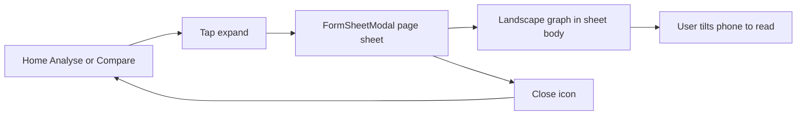

# Expanded landscape chart overlay

## Decision

No `expo-screen-orientation`, no `app.json` orientation change, **no fullscreen modal**.

Use the same overlay as add report and other CRUD flows: [`FormSheetModal`](components/FormSheetModal.jsx) (`presentationStyle="pageSheet"`, `CircleX` close, title). The **graph in the sheet body** is laid out as landscape. The user tilts the phone to read it. Close dismisses the sheet; the original portrait chart stays on the page behind.

[`app.json`](app.json) stays `"orientation": "portrait"`. Tilting does not rotate the rest of the app.

## Why this still gives more plotted values

The in-page chart is **220px** tall and as wide as the portrait column. Inside the sheet, the plot uses **swapped body dimensions** (measured from the sheet content box, not the full window):

- Chart width ≈ body height (the longer remaining edge)
- Chart height ≈ body width minus padding

Less width than a true fullscreen landscape window (page sheet leaves a top gap + header), still much more X-axis room than the in-page chart.

Analyse and Compare already load the full date range into the overlay (same series as the in-page chart).

Home [`HealthGraph`](components/widgets/HealthGraph.jsx) stays a **5-point preview** (`count={5}` on Overview). Expanding does **not** reuse those five points. Open the sheet and fetch that investigation with **no `count`** (all-time, same as Analyse with dates cleared), `enabled` only while the overlay is open so Home does not load full history for every widget up front. Cache key should match Analyse-without-dates (`['reports', undefined, undefined, investigation]`) so the two screens share data. The widget **Analyse** footer link stays.

## Expand icon placement

Not on the plot itself (top-right of the SVG would collide with the last node value).

Treat it as a **header action**, same idea as [`WidgetView`](components/WidgetView.jsx) `headerRight`:

- **Home:** in the widget header, **left of the existing remove `X`**: title | `Maximize2` | `X`. Pass both as `headerRight` (a small `flex-row`); no WidgetView API change required. Expand only when the preview has data.
- **Compare:** right side of the existing title row in [`CompareGraph`](components/CompareGraph.jsx) (`Compare A and B` on the left, `Maximize2` on the right). Legend stays below the title.
- **Analyse:** a short right-aligned row immediately **above** the in-page [`LineChart`](app/(tabs)/analyse.jsx) (no extra card). Investigation select and date range stay where they are.

44pt hit target, `accessibilityLabel="Expand chart"`. Only when that surface has chart data. The sheet uses the FormSheet `CircleX`; there is no expand icon inside the overlay.

## Overlay UX

- Reuse [`FormSheetModal`](components/FormSheetModal.jsx) the way [`NewReportDialog`](components/NewReportDialog.jsx) and [`ViewReportDialog`](components/ViewReportDialog.jsx) do: slide-up page sheet, `CircleX` close, **title in the sheet header**. **No confirm/check** (view-only).
- Header title matches the graph the user expanded:
  - **Home / Analyse:** investigation label (same as the widget title / selected investigation).
  - **Compare:** `Compare {label1} and {label2}` (same as the in-page card). Color legend stays in the sheet body, unrotated, above the graph.
- Body: `scrollable={false}` `padded={false}` (same as report preview) so the graph can fill from below the header to the bottom of the sheet.
- Keep the FormSheet **header unrotated** (close + title stay in the usual CRUD place). Only the graph in the body is landscape-laid-out: size to the measured body, then `translate` + `rotate`. Pick one rotation (likely `-90deg`) and verify on a device; flip if it feels inverted.
- **Web / already-wide windows:** do not rotate. Fill the sheet body with a larger chart in the current orientation.
- Close restores the underlying screen with no orientation side effects.

## Chart changes

[`LineChart`](components/charts/LineChart.jsx) hardcodes `CHART_HEIGHT` in layout, SVG, and X-label `y`. [`buildLinePoints`](components/charts/chartUtils.js) already accepts `height`.

- Add a `height` prop (default `CHART_HEIGHT`). Overlay measures the sheet body via `onLayout` and passes width + height (swapped when rotating).
- **Density:** thin X-axis dates when labels would collide (~40px each; always keep first and last). Hide node values in the overlay when they would overlap; keep the existing tap tooltip.
- If point spacing is under the 44px hit size, map one plot press to the **nearest** index instead of overlapping `Pressable`s.

New pieces:

- [`components/charts/ChartExpandDialog.jsx`](components/charts/ChartExpandDialog.jsx) — FormSheetModal wrapper, landscape graph in the body, measured `LineChart`
- Thinning helper in [`components/charts/chartUtils.js`](components/charts/chartUtils.js) + tests in [`chartUtils.test.js`](components/charts/__tests__/chartUtils.test.js)

Wire expand on:

- [`components/widgets/HealthGraph.jsx`](components/widgets/HealthGraph.jsx) — overlay fetches full series; preview query unchanged
- [`app/(tabs)/analyse.jsx`](app/(tabs)/analyse.jsx)
- [`components/CompareGraph.jsx`](components/CompareGraph.jsx) (pass through `yAxisKeys` / labels / units)

No server, URL, or identifier changes. Do not add a second Modal implementation.

## Risks

- **Touches after `transform`:** RN usually remaps hits with the parent; verify on iOS, Android, and web. Rotate one wrapper that contains both SVG and hit targets.
- **Rotation math uses the sheet body**, not the window. Page-sheet top inset and header shrink the landscape width compared to a fullscreen overlay.
- Close stays on the portrait sheet header; after a physical tilt it sits on a side until the user closes or untilts. That matches other CRUD sheets.
- Very long series still need thinning + tooltip. Pinch-zoom / pan can wait.

## Verification

- Home: expand sits left of remove; overlay shows **all** readings for that investigation (not five); widget preview stays five points; Analyse footer still works; empty widgets have no expand.
- Analyse and Compare: expand opens a page sheet with close + title; plot reads correctly when the phone is held in landscape; tooltips work; Close returns to the original chart (tabs/header intact).
- Overlay looks like add report (page sheet, close icon), not a fullscreen takeover.
- Web: sheet body fills with a large chart and does **not** rotate when the viewport is already landscape.
- In-page Home / Analyse / Compare charts stay 220px.
- Expand control only when that surface has chart data.
